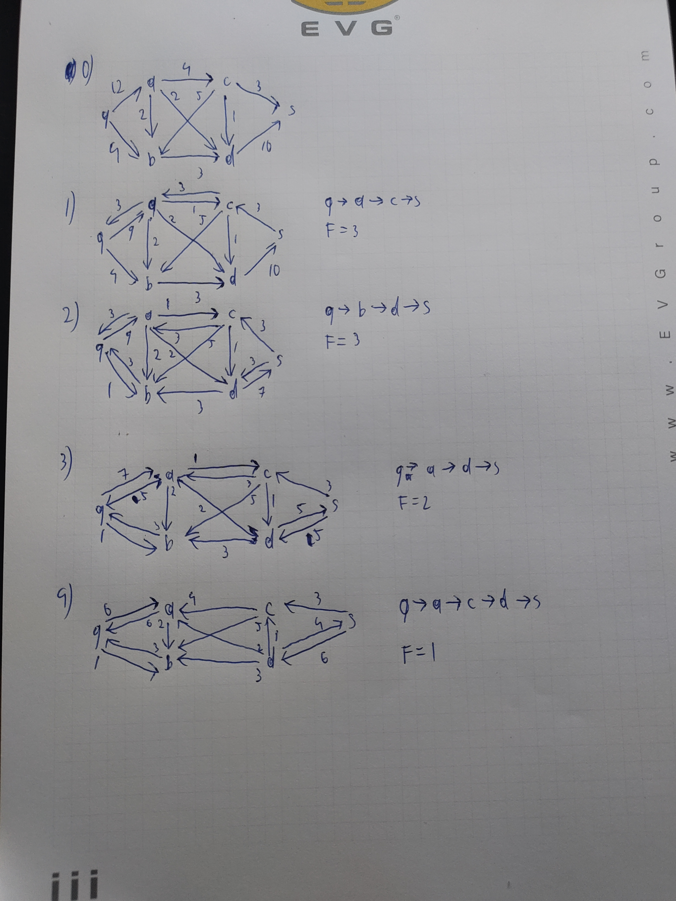

= Übung 06
:author: Florian Weingartshofer
:email: <S1910307103@students.fh-hagenberg.at>
:reproducible:
:experimental:
:listing-caption: Listing
:source-highlighter: rouge
:imgdir: ./img
:imagesoutdir: ./out
:stem:
:toc:
:numbered:

<<<
== PageRank

[latexmath]
++++
d=0.75
++++

[latexmath]
++++
\tilde{A}=
\begin{pmatrix}
0           & \frac{1}{2}   & 0 & 0 & 1\\
\frac{1}{3} & 0             & 1 & 0 & 0\\
\frac{1}{3} & \frac{1}{2}   & 0 & 0 & 0\\
\frac{1}{3} & 0             & 0 & 0 & 0\\
0           & 0             & 0 & 0 & 0\\
\end{pmatrix}
++++

[latexmath]
++++
\hat{A}=
\begin{pmatrix}
0           & \frac{1}{2}   & 0 & 0.2 & 1\\
\frac{1}{3} & 0             & 1 & 0.2 & 0\\
\frac{1}{3} & \frac{1}{2}   & 0 & 0.2 & 0\\
\frac{1}{3} & 0             & 0 & 0.2 & 0\\
0           & 0             & 0 & 0.2 & 0\\
\end{pmatrix}
++++

[latexmath]
++++
M=
\begin{pmatrix}
0.05    & 0.425 & 0.05  & 0.2 & 0.8\\
0.3     & 0.05  & 0.8   & 0.2 & 0.05\\
0.3     & 0.425 & 0.05  & 0.2 & 0.05\\
0.3     & 0.05  & 0.05  & 0.2 & 0.05\\
0.05    & 0.05  & 0.05  & 0.2 & 0.05\\
\end{pmatrix}
++++

[latexmath]
++++
R_0 = \begin{bmatrix}
0.2\\
0.2\\
0.2\\
0.2\\
0.2
\end{bmatrix}
++++

[latexmath]
++++
R_1 =\begin{bmatrix}
0.305\\
0.28\\
0.205\\
0.13\\
0.08
\end{bmatrix}
++++

[latexmath]
++++
R_2 =\begin{bmatrix}
0.2345\\
0.2995\\
0.25075\\
0.14575\\
0.0695
\end{bmatrix}
++++

[latexmath]
++++
R_3 =\begin{bmatrix}
0.2363\\
0.31855\\
0.2428\\
0.1304875\\
0.071862
\end{bmatrix}
++++

Der PageRank gewichtet wie viele Links von Websites zu einer anderen führen.
Umso stärker die anderen Websites gewichtet sind umso höher wird auch diese gewichtet.

<<<
== Zwischenzentralität

.Überlegung
[latexmath]
++++
a; f; b; g; c; d; e
++++

.NetworkX
[latexmath]
++++
a; f; g; b; c; d; e
++++

Es stimmt nicht ganz überein, allerdings ist der großteil gleich.

Die Zwischenzentralität gibt an, wie stark ein Knoten in den kürzesten Pfaden zwischen beliebigen Knoten vorkommt.

<<<
== Maximaler Fluss
Maximaler Fluss: `9`

== Minimaler Cut
Im Anhang.